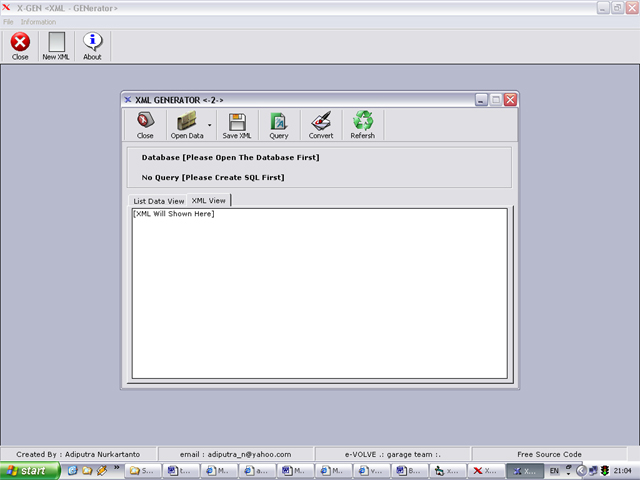



## \[ \-= XML GENERATOR =\- \]

### Description

-= INFORMATIKA-IPB =- Convert Database to XML. this code use classes. you just have to put the database file and the program will show table from your database. put the Query, the record result will shown in xml.
 
### More Info
 
File Database Access and Database SQL server

it's can return new File XML

             |
---                |---
**Submitted On**   |2004-09-02 17:40:14
**By**             |[Adiputra Nurkartanto](https://github.com/Planet-Source-Code/PSCIndex/blob/master/ByAuthor/adiputra-nurkartanto.md)
**Level**          |Advanced
**User Rating**    |4.5 (50 globes from 11 users)
**Compatibility**  |VB 6\.0
**Category**       |[Complete Applications](https://github.com/Planet-Source-Code/PSCIndex/blob/master/ByCategory/complete-applications__1-27.md)
**World**          |[Visual Basic](https://github.com/Planet-Source-Code/PSCIndex/blob/master/ByWorld/visual-basic.md)
**Archive File**   |[x\_gen1798679292004\.zip](https://github.com/Planet-Source-Code/adiputra-nurkartanto-xml-generator__1-56416/archive/master.zip)

